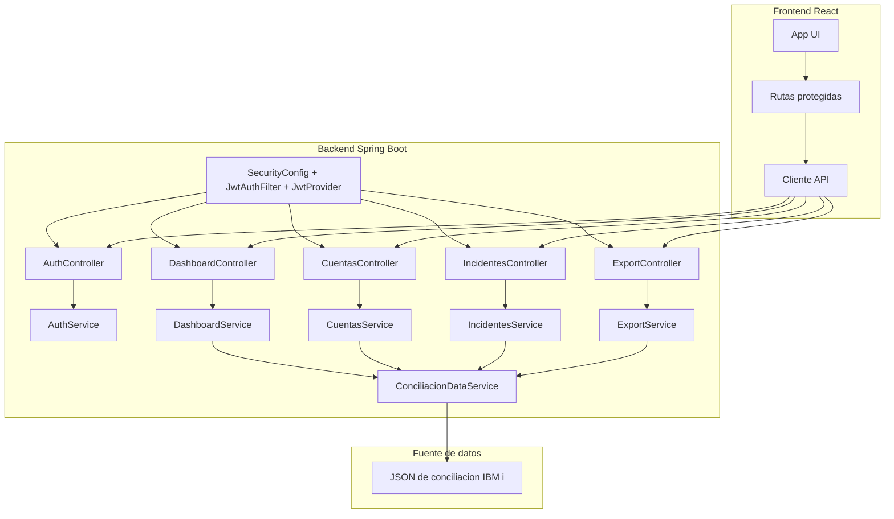

# Diagrama de Componentes

Este documento describe la arquitectura de componentes de la solucion fullstack de conciliacion.

## Responsabilidades

- Frontend: autenticacion, visualizacion de KPIs, filtros, detalle, incidentes y exportacion.
- Backend: autenticacion JWT, reglas de negocio y exposicion de endpoints REST.
- Data service: lectura y transformacion de payload de conciliacion desde fuente JSON.

## Notas

- Los controladores solo orquestan requests/responses HTTP.
- La logica de autenticacion y rol se centraliza en `AuthService`.
- La seguridad transversal se aplica mediante filtro JWT y configuracion de Spring Security.
